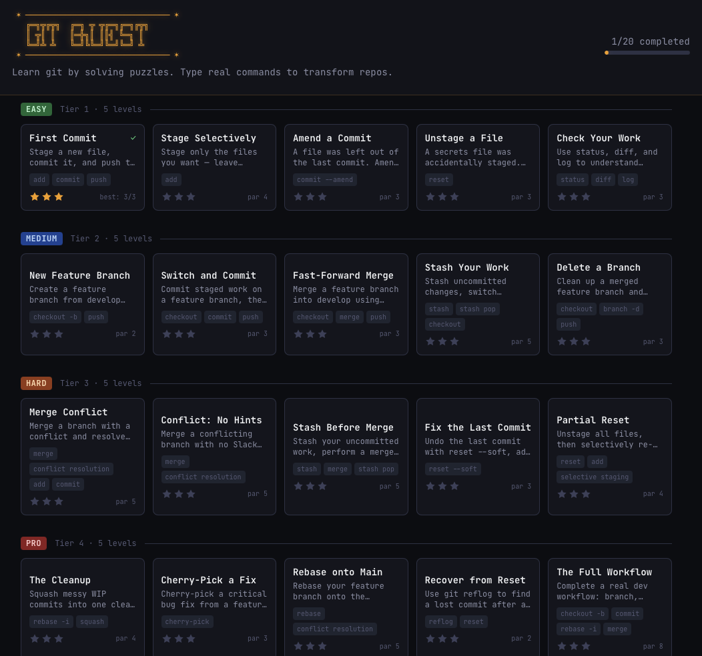
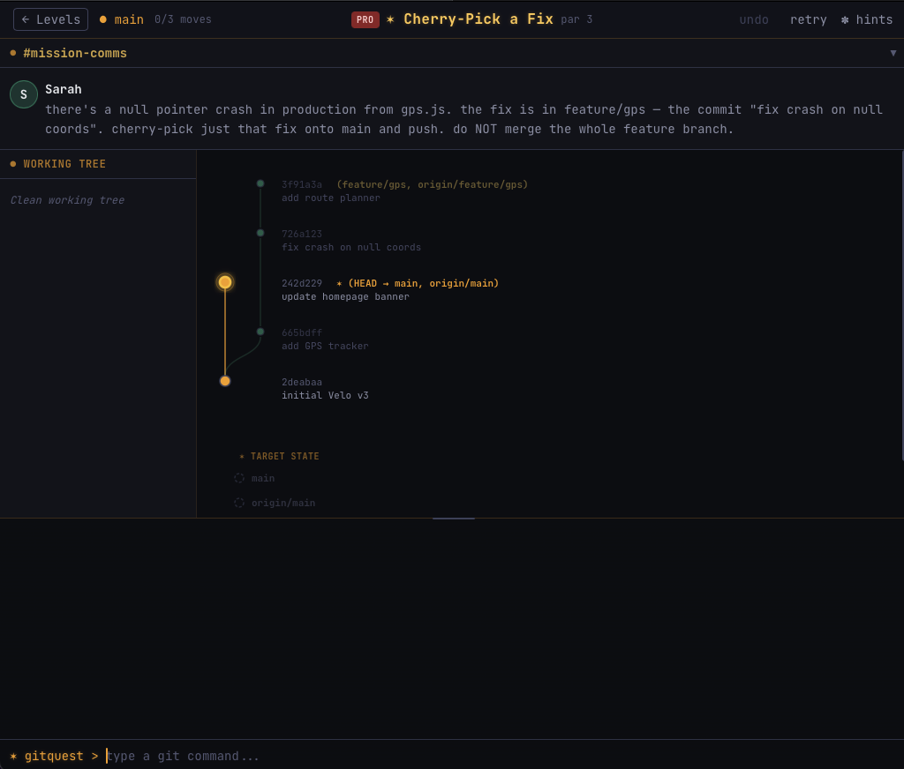

# GitQuest

A browser-based puzzle game for learning git. Players type real git commands in a simulated terminal to transform a repository from a starting state into a target state.

Read Slack-style conversations from fictional coworkers, observe an interactive SVG git graph, and solve the puzzle with the fewest commands possible.

**Play now:** [https://massimogennaro.github.io/git-quest/](https://massimogennaro.github.io/git-quest/)

### Level Select

Browse 20 levels across 4 difficulty tiers -- Easy, Medium, Hard, and Pro. Each card shows the git commands involved, par score, and your best rating.



### Gameplay

Each level presents a Slack-style briefing, an interactive SVG git graph, a working tree panel, and a terminal. Type real git commands to reach the target state.



## Features

- **Simulated git engine** -- pure TypeScript, no real git needed. Supports `add`, `branch`, `checkout`, `commit`, `log`, `merge`, `push`, `status`.
- **Interactive SVG git graph** -- real-time visualization with ghost overlay showing the target state.
- **Slack-style narrative** -- fictional coworkers give context and hints through triggered messages.
- **Three-panel merge editor** -- resolve conflicts visually (ours | result | theirs) with line-level diff highlighting.
- **Par-based scoring** -- earn up to 3 stars per level. Undo moves, retry levels.
- **4 difficulty tiers** -- from first commits to merge conflicts, with 4 levels in the MVP.

## Quick Start

```bash
git clone https://github.com/MassimoGennaro/git-quest.git
cd git-quest
npm install
npm run dev        # http://localhost:5173
```

## Commands

| Command | Description |
|---|---|
| `npm run dev` | Start Vite dev server |
| `npm run build` | Production build (`tsc && vite build`) |
| `npm run preview` | Preview production build |
| `npm test` | Run tests (Vitest, watch mode) |
| `npx vitest run` | Run tests once (CI mode) |
| `npm run lint` | Run ESLint |

## Tech Stack

| Layer | Technology |
|---|---|
| Language | TypeScript (strict mode) |
| Framework | React 18 (hooks only) |
| Styling | Tailwind CSS |
| Graph rendering | Custom SVG (no external graph library) |
| State management | React Context + `useReducer` |
| Build | Vite |
| Testing | Vitest |
| Persistence | `localStorage` |

No backend. Everything runs in the browser.

### Browser State

GitQuest saves your progress to `localStorage` so it persists between sessions. The following data is stored:

- **Level completion status** -- which levels you have finished.
- **Star ratings** -- best score (1-3 stars) for each completed level.
- **Command count** -- fewest commands used per level (used for par comparison).

This data never leaves your browser -- there are no accounts, no server calls, and no cookies. Clearing your browser's site data will reset all progress.

## Project Structure

```
src/
  engine/          # Git simulation -- pure TypeScript, zero React imports
  levels/          # Data-driven level definitions + win condition checker
  components/      # React components (layout, panels, overlays)
  hooks/           # useGitEngine, useLevel, useTerminal
  context/         # GameContext (level navigation, scoring, retry)
docs/
  README.md        # Detailed project overview
  SPEC.md          # Full product & UI specification
  ARCHITECTURE.md  # Technical architecture & data models
  LEVELS.md        # Level design guide + example scenarios
tests/
  engine/          # Engine unit tests (123 tests)
  levels/          # Win condition tests
```

See [docs/ARCHITECTURE.md](docs/ARCHITECTURE.md) for the full module map and data types.

## Contributing

Contributions are welcome! Please read [CONTRIBUTING.md](CONTRIBUTING.md) for guidelines on setup, workflow, code style, and how to author new levels.

## License

[MIT](LICENSE)
